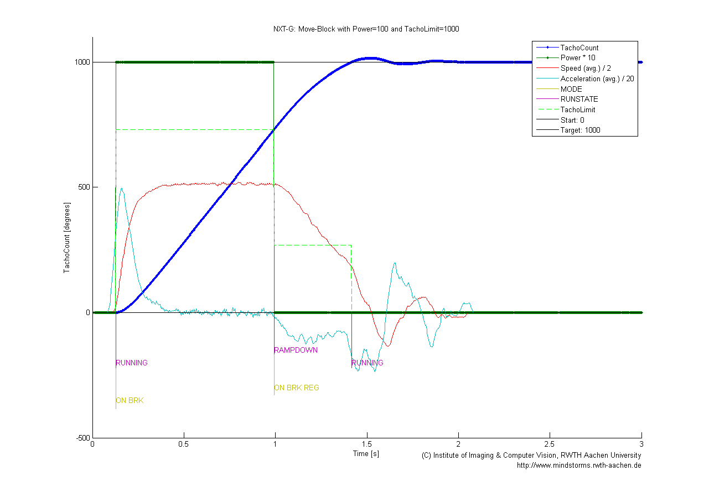
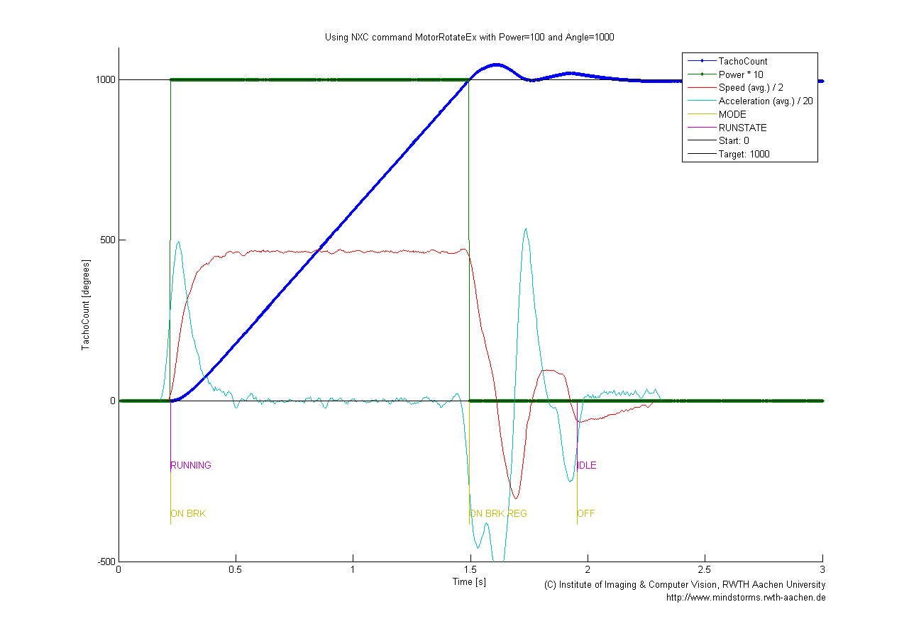
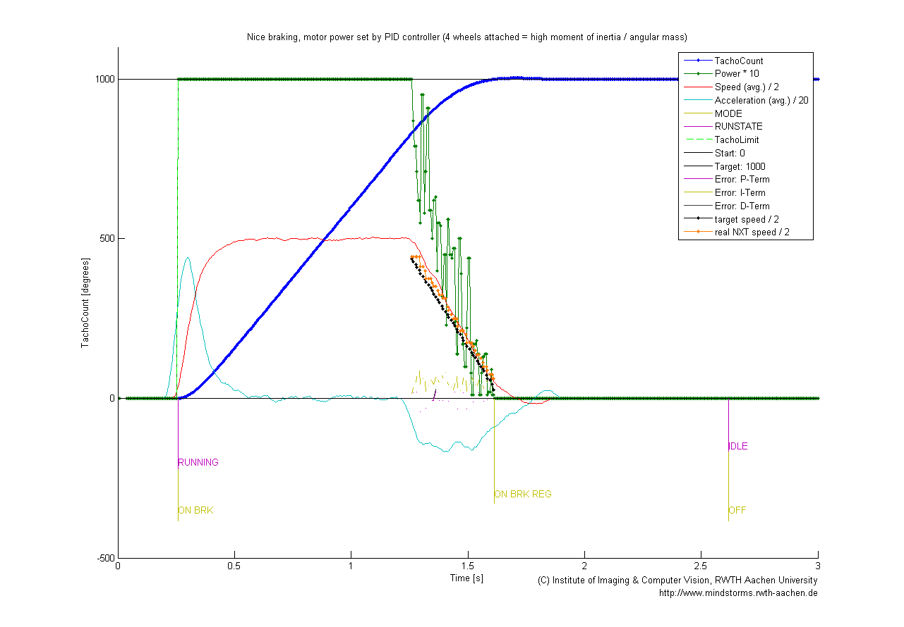

# Motor Control

**Extracted from [web archive].**

[web archive]: https://web.archive.org/web/20190110121255/http://www.mindstorms.rwth-aachen.de/trac/wiki/MotorControl

## What is the MotorControl program?

Since version 2.01, the RWTH - Mindstorms NXT toolbox for MATLAB comes with an
NXC program called MotorControl. This program gets compiled (using the NXC/NBC
compiler) to a binary RXE file which is transferred to the NXT brick. During
execution of MATLAB programs, MotorControl keeps running on the NXT and is
receiving commands. The NXC program then takes care of the motors and controls
them precisely, while the MATLAB program can continue execution. The latest
version is MotorControl 2.2 (comes with toolbox version 4.04).

Other open source software that uses MotorControl:

- [nxt-python](http://code.google.com/p/nxt-python/) (a Python module to
  control NXTs) since version 2.2.0.
- [MindSqualls](http://www.mindsqualls.net/) (a .net library to control NXTs)
  since version 2.1.
- [Math4NXT](http://web5.uottawa.ca/www5/dcousineau/home/Others/Math4NXT) (a
  package for Wolfram Mathematica) since its first release.

## Transfer MotorControl to NXT

- Get `NeXTTool.exe` from <http://bricxcc.sourceforge.net/utilities.html> and
  save it to `/tools/MotorControl` (subfolder of the toolbox)
- Use NeXTool to download `MotorControl*.rxe` (Available from
  [/tools/MotorControl](http://www.mindstorms.rwth-aachen.de/trac/browser/trunk/tools/MotorControl))
  to your NXT (there should only be one MotorControl on the NXT). On Windows,
  call `TransferMotorControlBinaryToNXT.bat`.
- Follow the on-screen instructions
- If this doesn't work, you can try a different method / batch file. You need
  the NBC compiler for this step, get it here:
  <http://bricxcc.sourceforge.net/nbc/>, or try the latest version from
  `test_release.zip` from <http://bricxcc.sourceforge.net/>

## Limitations of direct commands for motor movements

When trying to control motors via direct commands such as `SetOutputState`
(see LEGO NXT BDK from
[here](http://mindstorms.lego.com/en-us/support/files/default.aspx#Advanced)),
one notices two problems:

- The motor cannot be turned to a precise position, it always overshoots (i.e.
  turns too far). The LEGO firmware only turns off the power to the motor when
  the set `TachoLimit` property is met, leaving the motor spinning freely in
  coast mode. An automatic "braking" is missing.

- The LEGO firmware provides an automatic error correction mechanism to
  account for imprecise movements. Unfortunately, due to the overshooting
  described above, this error is very big when using direct commands. The
  error correction can lead to unexpected results, like when a motor seems to
  ignore certain `SetOutputState` commands. This is explained
  [here](http://www.mindstorms.rwth-aachen.de/documents/downloads/doc/troubleshooting.html#7).

Further reading: See NXT Motor Internals below!

## The solution

While the internal error correction of the LEGO firmware can be deactivated
using I/O map commands and the output module map, precise motor commands
(where the firmware automatically turns motors to a specific position or
distance) are still not possible. That is why the embedded program
MotorControl was developed. Without Bluetooth or USB latencies running
directly on the brick it's the perfect place to implement a controller
algorithm for the motors. A method how computer and NXC programs can
communicate with each other is described
[here](https://sourceforge.net/apps/phpbb/mindboards/viewtopic.php?f=3&t=181&start=0#p1607).

## Features

- Precise motor movements to any position (accurate to +/- 1 degree in 90% of
  the time)
- Smooth braking / soft stop
- Anti-stall-protection (motor doesn't get stuck during deceleration)
- Smooth acceleration (soft start) optional
- Synchronized driving (for two-wheeled driving robots) supported
- Controls all three motors independently
- Movements/commands can be cancelled at all times
- Motors and sensors can be monitored at all times (as usual)
- End of movement can be detected

## Requirements

- Official LEGO Mindstorms NXT firmware version 1.26 or better (i.e. 1.28, or
  John Hansens enhanced firmware 1.2x)
- Execution on LEGO firmware 1.05 is possible in theory, but performance is
  probably too bad
- Around 32kb free flash memory on the NXT
- The direct commands `MessageRead` and `MessageWrite` must be implemented on
  the computer / mobile device
- For direct commands related to motors, small waiting periods (pauses in
  program execution before sending the commands) have to be implemented to
  avoid conflicts with MotorControl and contradicting motor data

## Example plots

NXT-G, the graphical software which comes with the NXT kit and which produces
bytecode programs to be executed by the brick, has the "Move Block" for
precise robot movements. It uses a combination of different RUNSTATEs and
MODEs (such as RUNNING, followed by RAMPDOWN), set at precise momements in
time. As you can see, there are little oscillations of the motor position
around the target (blue line).



NXC is a C-like text-based programming language which comes with the IDE
BricxCC. It also produces programs that run on the NXT brick. It provides
functions called MotorRotate and MotorRotateEx. They work by "jamming in the
hard brake at the target position". You can notice strong oveshooting,
followed by corrections of the motor position (blue line).



MotorControl is written in NXC and uses a custom PID-controller to regulate
the speed just before the target position. This generates a nice, smooth
braking, but also prevents stalling. There are virtually no oscillations (blue
line).



## Feel free to use it!

Since the RWTH - Mindstorms NXT Toolbox is open source, you are very welcome
to use MotorControl in your own applications. This site is intended to
document how the external interface (called "MotorControl protocol" or just
protocol from now on) works and has to be used. The existing MotorControl
program could then be used and operated from any language running on a
computer or mobile device which supports direct commands. No knowledge of NXC
is required (unless you want to adapt or modify the code of course).

## License issues

Since MotorControl is part of the RWTH - Mindstorms NXT Toolbox, it's licensed
under the GPLv3. This means you have to publish your work under the GPL
license, too (should you decide to use MotorControl). If for some reason this
license is not acceptable for you, please contact us by mail (see below)!

## Contact

If you have any questions or feedback, don't hesitate to send us a mail:

- mindstorms(at)lfb.rwth-aachen.de
- linus.atorf(at)rwth-aachen.de 

## Where to get it

MotorControl usally comes with the toolbox, folder `/tools/MotorControl`. You
should also find the current stable version in the latest `tags-folder` of our
SVN repository, or take the very latest development from
`trunk/tools/MotorControl`.

# NXT Motor Internals

If you want a deeper insight how the NXT motors work in detail and what can be
done to control them, you should spend some time with the following links:

- [Philo's NXT Motor Internals](http://www.philohome.com/nxtmotor/nxtmotor.htm),
  a must read!
- [Absolute position regulation](http://nxt-firmware.ni.fr.eu.org/changes/absolute_position_regulation/)
  of the improved NXT firmware project.
- `MotorTests` folder in SVN, containing many useful plots, tests, and tools
  which were used to characterize the original Firmware's behavior and to
  develop MotorControl.
- [LeJOS](http://lejos.sourceforge.net/), an open-source OS / Java VM for the
  NXT, has a sophisticated motor control. See 
    - [PDF](http://www.gloomy-place.net/lejos/lejospid.pdf) about the internal
      PID controllers
    - [Comparision](http://www.gloomy-place.com/lejosmotor.htm) and
      explanation of LeJOS motor drivers vs. original firmware.
- This [PID motor control block](http://www.hitechnic.com/blog/uncategorized/pid-block/)
  for NXT-G by !HiTechnic might also be useful
- To better understand MotorControl and the LEGO firmware, it definitely helps
  to get familiar with NXC and its motor commands. Documentation is here:
  <http://bricxcc.sourceforge.net/nbc/>

# Documentation of the MotorControl protocol

## General Communication

Most of the communication in this protocol is uni-directional. This means, the
computer (or mobile device) sends a string to the NXT, and MotorControl
running on the NXT reacts to it. Each string contains one command. We send the
strings as mailbox-messages. For this, the direct command `MessageWrite` is
used. Should strings (i.e. replies) have to be retrieved from the NXT, the
command `MessageRead` is used. For more details on this method, see
[here](https://sourceforge.net/apps/phpbb/mindboards/viewtopic.php?f=3&t=181&start=0#p1607).

Different mailboxes are used for the PC->NXT channel and the NXT->PC channel
respectively. In our case, this currently means:

From the side of the PC:

- `PC_INBOX = 0` 
- `PC_OUTBOX = 1`

This means, we have to write data to mailbox 1 (MotorControl will look there).
For replies to commands, we have to check box 0 (MotorControl will put data
there if told to).

From the NXT-side, this looks of course the other way round:

- `NXC_INBOX = 1` 
- `NXC_OUTBOX = 0`

From now on, we'll keep our focus on the computer side (since MotorControl in
NXC already exists ;-)). Most of the time, we just write to mailbox 1 ("send
and forget").

## Sending commands

When we want the motor to execute a movement, we simply send the correct
string to the according mailbox. The motor for the specified port must be
idle, i.e. it can't be carrying out any other movement commands at the time
when the new command arrives. If this should happen, the NXT will indicate
this erroneous user behavior by a signal (high and low beep) and will drop
(ignore) the message. To find out if a motor is ready to accept new commands,
you can use the *ISMOTORREADY* command. It's also possible to stop the motor
before (i.e. cancelling the current command). To do so, you can send a
specially formed `SetOutputState` direct command (details explained below).

If you send a command which requests a reply (currently *ISMOTORREADY* and in
theory also *JUMBOPACKET*), the client (the program you're writing) has to be
well-behaved, i.e. it has to collect the message it just requested. If it
doesn't do that, there might be unforseen consequences. You can always restart
MotorControl on the NXT (using the direct commands `StopProgram` and
`StartProgram`).

## Message format

We always send strings. The first char of the string indicates the command
type. It's a number (as string) from currently `"1"` to `"5"`. The packets
have a fixed length (no string termination is used), depending on the command
type. The individual commands are explained in detail during the next
sections. A packet / message looks like this:

- Header: command type (1 char)
- Payload (n chars)

## Command types

Currently, the following command-types are defined in MotorControl:

1. `PROTO_CONTROLLED_MOTORCMD`
2. `PROTO_RESET_ERROR_CORRECTION`
3. `PROTO_ISMOTORREADY`
4. `PROTO_CLASSIC_MOTORCMD`
5. `PROTO_JUMBOPACKET`

### CONTROLLED_MOTORCMD

This is the most important command. It contains a lot of parameters to tell
the according motor(s) how and where to move. This is the actual reason
MotorControl was developed. However, in certain situations, *CLASSIC_MOTORCMD*
should be used instead (see below why). One of the reasons we have to decide
in the high-level-client when to use *CONTROLLED_MOTORCMD* and when not is
that in NXC, CPU-time is valuable, while on a computer we've got plenty!

**Message format:**

- Header: `"1"`
- Port (1 char)
- Power (3 chars)
- TachoLimit (6 chars)
- Mode (1 char)

Parameters can take the following values:
- Port: 1 char from "0" to "5":
    - "0" = Port A
    - "1" = Port B
    - "2" = Port C
    - "3" = Ports A & B (synced)
    - "4" = Ports A & C (synced)
    - "5" = Ports B & C (synced)
- Power: 3 chars from "0" to "200":
    - "0" to "100" = power 0 to 100
    - "101" to "200" = power -1 to -100
- TachoLimit: 6 chars from "0" to "999999"
    - "0" means driving forever, no limit *(better not use it, see also CLASSIC_MOTORCMD)*
    - everything else: drive to specific position
- Mode: 1 char, bitfield. Compose bits to integer (by OR or +), convert to char
    - Start with 0x00 (000)
    - Set 0x01 (001) / add 1: Set for HoldBrake (keeps active brake on after
      end of movement)
    - Set 0x02 (010) / add 2: Set to enable SpeedRegulation
    - Set 0x04 (100) / add 4: Set to enable SmoothStart
    - Example: "5" means 0x05 (101) = HoldBrake and SmoothStart ar enabled, no
      SpeedRegulation

Example message (string):

```
120990010002
```

This drives motor C (port 2) with power 99 for 1000 degrees with speed
regulation enabled.

Reference implementation: [NXC_MotorControl.m](NXC_MotorControl.m)

### RESET_ERROR_CORRECTION

This command can be used to reset the NXT's internal error correction
mechanism (i.e. reset the `TachoCount` property). The same thing can be
achieved using the IO map commands (with the output module).

**Message format:**

- Header: `"2"`
- Port (1 char)

- Port: 1 char from "0" to "6":
    - "0" = Port A
    - "1" = Port B
    - "2" = Port C
    - "3" = Ports A & B 
    - "4" = Ports A & C 
    - "5" = Ports B & C
    - "6" = Ports A & B & C

Example message (string):

```
26
```

Resets error correction and TachoCount for all ports.

Reference implementation:
[NXC_ResetErrorCorrection.m](NXC_ResetErrorCorrection.m)

### ISMOTORREADY

This command is used to determine the state of a single motor: Is it currently
executing a command (i.e. moving) or is it ready to accept new commands?
Bi-directional communication is used. We send a request and keep asking for
the reply (i.e. we poll the computer's inbox). We have to make sure that for
each request we make, we also retrieve the answer (to leave MotorControl in a
clean state). Please note that we can (in theory) make multiple requests
concerning different motors at the same time, as long as we keep polling the
incoming mailbox and collect all replies.

**Message format (request):**

- Header: `"3"`
- Port (1 char)

Parameters can take the following values:

- Port: 1 char from "0" to "2":
    - "0" = Port A
    - "1" = Port B
    - "2" = Port C

**Message format (reply):**

- Port (1 char)
- IsReady (1 char)

- Port as above
- IsReady:
    - "0" = no (still busy)
    - "1" = yes (idle/ready)

The reply contains the port-number of the request, so we can assign answers to
requests.

Example message (string):

```
32
```

Is motor C ready?

Answer (string):

```
21
```

Yes, motor C is ready!

Reference implementation: [WaitFor.m](WaitFor.m)

### CLASSIC_MOTORCMD

This command is very similar to the classic `SetOutputState`: Sometimes we
don't need any fance position control algorith, we just want to drive the
motors. So this command is used when we have a TachoLimit of 0. Actually we
don't have to invoke our NXC MotorControl program at all if we just want to
drive without a TachoLimit. We could use `SetOutputState`, but this is a bit
dangerous: It could interfere with a command that's already being executed by
MotorControl. For this and some other design reasons, we pass the parameters
on to MotorControl just as we do for controlled operations. Another situation
when this command is applicable: Stopping in COAST mode, i.e. when you set a
TachoLimit, but you want the motor to coast to a very soft stop. Then the NXC
program doesn't have to do anything for us. In this case, this command just
does a ResetErrorCorrection and a SetOutput for us in NXC.

Summary: When to use *CLASSIC_MOTORCMD* (instead of *CONTROLLED_MOTORCMD*?

- When you've got a `TachoLimit = 0`
- When you want your motor to coast (spin freely) after a TachoLimit has been
  reached (it will overshoot then)
- When you want to change the power of a currently running motor, you can use
  this command to overwrite the power level at runtime (only works if the
  operation wasn't started with *CONTROLLED_MOTORCMD*)

**Message format:**

- Header: `"4"`
- Port (1 char)
- Power (3 chars)
- TachoLimit (6 chars)
- SpeedRegulation (1 char)

Parameters can take the following values:

- Port: 1 char from "0" to "5":
    - "0" = Port A
    - "1" = Port B
    - "2" = Port C
    - "3" = Ports A & B (synced)
    - "4" = Ports A & C (synced)
    - "5" = Ports B & C (synced)
- Power: 3 chars from "0" to "200":
    - "0" to "100" = power 0 to 100
    - "101" to "200" = power -1 to -100
- TachoLimit: 6 chars from "0" to "999999"
    - "0" means driving forever (no limit)
    - everything else: drive to specific position
- SpeedRegulation: 1 char
    - "0" = disabled
    - "1" = enabled

Reference implementation: [NXC_MotorControl.m](NXC_MotorControl.m)

### JUMBOPACKET

Not yet implemented.

**Message format:**

- Header: `"5"`

Reference implementation (in the future):
[NXC_GetSensorMotorData.m](NXC_GetSensorMotorData.m)

## Cancelling commands

When a certain motor is running, you can always cancel the current operation
by sending two types of "stop" commands. By "stop" I just mean a certain
parameter combination for `SetOutputState`. If you want to stop multiple
motors, you have to send a direct command to each one of them. The
MotorControl program will recognize this "cancellation request" and stop the
control algorithm. 

Reference implementation: [Stop.m](Stop.m)

We've got:

### Stopping (coasting)

This means turning off power to a motor, leaving it spinning freely
(coasting). To do this, the corresping NXC-code looks like this:

```c
SetOutput(port, Power, 0, OutputMode, OUT_MODE_COAST, RegMode,
	OUT_REGMODE_IDLE, RunState, OUT_RUNSTATE_IDLE, UpdateFlags,
	UF_UPDATE_MODE + UF_UPDATE_SPEED);
```

This is basically just setting a power of 0 and setting everything else to OFF
or IDLE...

### Active braking

This will actively hold the motor at its current position (and act against
forces which try to move it). This consumes a lot of power. The NXC-code to do
this is:

```c
SetOutput(port, Power, 0,
          OutputMode,  OUT_MODE_BRAKE + OUT_MODE_MOTORON + OUT_MODE_REGULATED,
          RegMode,     OUT_REGMODE_SPEED,
          RunState,    OUT_RUNSTATE_RUNNING,
          UpdateFlags, UF_UPDATE_MODE + UF_UPDATE_SPEED);
```

So this means we set a power of 0, but with the motor running and speed
regulation enabled!

## Pauses

To avoid mailbox queue overflows and to ensure the NXC program is responding,
the computer program has to be "patient" and well-behaved. Certain waiting
periods have to be kept to make sure MotorControl doesn't get flooded with
commands. Also these pauses are extremly important to make sure that the NXC
program is in a well-known state: There are certain "dead spots" where the
LEGO firmware sets registers (of the output IO map) and starts up the motors.
If we request the current motor state during this period (via command
`GetOutputState`), the results will be inconsistent with what we expect (a
moving motor). By waiting small amounts of time, we give MotorControl and the
NXT brick time to start up the necessary tasks and motors...

We distinguish between two kinds of pauses:

- **Static pauses**: These are the normal cases. A static pause of 10ms means
  the program has pause execution for exactly 10 milliseconds, no matter what.
  Straight forward. This usually means just inserting a `Wait()`, `Sleep()`,
  or `Pause()` function.
 
- **Dynamic / minimal pauses**: By this word I mean "wait a minimal amount of
  time between two certain things". If more time has passed (for whatever
  reason), no problem. The program can continue anyway. For example, if a
  minimal pause of 30ms has to be inserted between command A and command B,
  this means we have to wait at least 30ms. To get best performance, we
  shouldn't wait 30ms in any case (which we would do by just inserting a
  static pause). We'd better record the time just after command A, and just
  before command B we check if at least 30ms have passed. If so, we continue,
  otherwise we wait the remaining time. If something happens between A and B
  anyway (or something takes longer on slow machines), we just make sure that
  *at least* a period 30ms lies between A and B. We can usually implement this
  using a simple millisecond-tick-counter.
 
Example for dynamic / minimal pause:

```c
// Event A (or command A)
tickCountA = GetSystemMilliseconds();

....

// before event B we check if we have to wait
while((GetSystemMilliseconds() - tickCountA) < 30) {
	// do nothing, wait...
}
// now we can execute B
```

For all those dynamic / minimal pause we just have wait between commands for
the same motor port of course (unless indicated otherwise). So usually a
command for motor B can be executed / sent to the NXT, no matter when the last
command concerning motor A was sent. This is easily implemented using 3
independent timestamps (or tickCounter variables). 

Basically for our protocol, you have to keep track of two independent events
for each motor:

- When was the last time a protocol string message was sent to a specific
  motor
- When was the last time a stop command (using `SetOutputState` as decribed
  above) was sent to a specific motor.

Using these timestamps, you can make sure the correct pauses are kept (see
list below).

**Note:** All these commands and waiting pauses have only been tested with a
maximal direct command packet rate of about 333 per second. So if you somehow
manage to send a direct command to the NXT more than once ever 3ms, maybe
stability decreases or additional pauses / rate limits are necessary.

## List of necessary pauses

### Before sending a string motor command message

Before sending the *CONTROLLED_MOTORCMD* or the *CLASSIC_MOTORCMD* messages,
insert

- Dynamic / minimal pause of **15 ms** since having sent the last protocol
  string message (for the same motor(s) -- otherwise, no waiting needed).
 
- Dynamic / minimal pause of **15 ms** since having sent the last stop motor
  direct command (i.e. using `SetOutputState`) (for the same motor(s) --
  otherwise, no waiting needed)

Due to the dynamic "minimal" character, these two pauses won't add up to 30ms
but to a total of still 15 ms (if the first pause triggers, the 2nd isn't
necessary anymore and vice versa).
 
### Before sending a stop command (via `SetOutputState`)

- Dynamic / minimal pause of **15 ms** since having sent the last protocol
  string message (for the same motor(s) -- otherwise, no waiting needed).

### Before reading motor data using `GetOutputState`

- Dynamic / minimal pause of **15 ms** since having sent the last protocol
  string message (for the same motor(s) -- otherwise, no waiting needed).

### When querying motor status (using ISMOTORREADY)

- Dynamic / minimal pause of **10 ms** after sending the ISMOTORREADY command
  to a specific motor, before retrieving the answer (this can also be a static
  pause if you like to).

- Dynamic / minimal pause of **10 ms** between sending several ISMOTORREADY
  commands to a specific motor, *only needed when using USB connections* (this
  can also be a static pause if you like to).
 
- Static pause of **10 ms** after having retrieved the answer to ISMOTORREADY,
  before returning back to normal program execution (i.e. before giving user
  level programs the possibility to send new motor commands or retrieve motor
  data).
 
## Known problems and limitations

